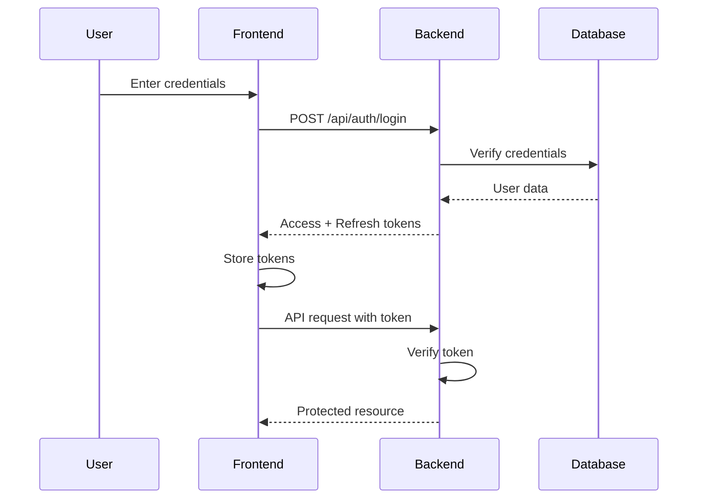

# Scouting Outing Manager - Authentication & Authorization

## Overview

This document outlines the authentication and authorization strategy for securing the Scouting Outing Manager application, with a focus on protecting the admin interface while keeping participant signup accessible.

## Authentication Strategy

### JWT-Based Authentication

We'll implement JWT (JSON Web Token) based authentication with the following characteristics:

- **Access Tokens**: Short-lived (15 minutes) for API requests
- **Refresh Tokens**: Long-lived (7 days) for obtaining new access tokens
- **Secure Storage**: HttpOnly cookies for refresh tokens, localStorage for access tokens



## Database Schema Updates

### New Tables

#### users
```sql
CREATE TABLE users (
    id UUID PRIMARY KEY DEFAULT gen_random_uuid(),
    email VARCHAR(255) UNIQUE NOT NULL,
    hashed_password VARCHAR(255) NOT NULL,
    full_name VARCHAR(255) NOT NULL,
    role VARCHAR(50) NOT NULL DEFAULT 'admin',
    is_active BOOLEAN DEFAULT true,
    created_at TIMESTAMP DEFAULT CURRENT_TIMESTAMP,
    updated_at TIMESTAMP DEFAULT CURRENT_TIMESTAMP
);

CREATE INDEX idx_users_email ON users(email);
CREATE INDEX idx_users_role ON users(role);
```

#### refresh_tokens
```sql
CREATE TABLE refresh_tokens (
    id UUID PRIMARY KEY DEFAULT gen_random_uuid(),
    user_id UUID NOT NULL REFERENCES users(id) ON DELETE CASCADE,
    token VARCHAR(500) NOT NULL,
    expires_at TIMESTAMP NOT NULL,
    created_at TIMESTAMP DEFAULT CURRENT_TIMESTAMP,
    revoked BOOLEAN DEFAULT false
);

CREATE INDEX idx_refresh_tokens_user_id ON refresh_tokens(user_id);
CREATE INDEX idx_refresh_tokens_token ON refresh_tokens(token);
```

## User Roles

### Role Definitions

1. **admin**: Full access to all features
   - Create, edit, delete outings
   - View all signups
   - Export data
   - Manage users (future)

2. **participant**: Public access (no authentication required)
   - View available outings
   - Submit signups
   - View own signups (with signup ID)

## Backend Implementation

### 1. Security Configuration

**File: backend/app/core/security.py**
```python
from datetime import datetime, timedelta
from typing import Optional
from jose import JWTError, jwt
from passlib.context import CryptContext
from fastapi import HTTPException, status

# Configuration
SECRET_KEY = "your-secret-key-here"  # Should be in environment variables
ALGORITHM = "HS256"
ACCESS_TOKEN_EXPIRE_MINUTES = 15
REFRESH_TOKEN_EXPIRE_DAYS = 7

pwd_context = CryptContext(schemes=["bcrypt"], deprecated="auto")

def verify_password(plain_password: str, hashed_password: str) -> bool:
    """Verify a password against its hash"""
    return pwd_context.verify(plain_password, hashed_password)

def get_password_hash(password: str) -> str:
    """Hash a password"""
    return pwd_context.hash(password)

def create_access_token(data: dict, expires_delta: Optional[timedelta] = None) -> str:
    """Create a JWT access token"""
    to_encode = data.copy()
    if expires_delta:
        expire = datetime.utcnow() + expires_delta
    else:
        expire = datetime.utcnow() + timedelta(minutes=ACCESS_TOKEN_EXPIRE_MINUTES)
    
    to_encode.update({"exp": expire, "type": "access"})
    encoded_jwt = jwt.encode(to_encode, SECRET_KEY, algorithm=ALGORITHM)
    return encoded_jwt

def create_refresh_token(data: dict) -> str:
    """Create a JWT refresh token"""
    to_encode = data.copy()
    expire = datetime.utcnow() + timedelta(days=REFRESH_TOKEN_EXPIRE_DAYS)
    to_encode.update({"exp": expire, "type": "refresh"})
    encoded_jwt = jwt.encode(to_encode, SECRET_KEY, algorithm=ALGORITHM)
    return encoded_jwt

def decode_token(token: str) -> dict:
    """Decode and verify a JWT token"""
    try:
        payload = jwt.decode(token, SECRET_KEY, algorithms=[ALGORITHM])
        return payload
    except JWTError:
        raise HTTPException(
            status_code=status.HTTP_401_UNAUTHORIZED,
            detail="Could not validate credentials",
            headers={"WWW-Authenticate": "Bearer"},
        )
```

### 2. Authentication Dependencies

**File: backend/app/api/deps.py**
```python
from fastapi import Depends, HTTPException, status
from fastapi.security import HTTPBearer, HTTPAuthorizationCredentials
from sqlalchemy.ext.asyncio import AsyncSession
from app.core.security import decode_token
from app.db.session import get_db
from app.models.user import User
from app.crud.user import get_user_by_id

security = HTTPBearer()

async def get_current_user(
    credentials: HTTPAuthorizationCredentials = Depends(security),
    db: AsyncSession = Depends(get_db)
) -> User:
    """Get the current authenticated user"""
    token = credentials.credentials
    payload = decode_token(token)
    
    if payload.get("type") != "access":
        raise HTTPException(
            status_code=status.HTTP_401_UNAUTHORIZED,
            detail="Invalid token type"
        )
    
    user_id = payload.get("sub")
    if user_id is None:
        raise HTTPException(
            status_code=status.HTTP_401_UNAUTHORIZED,
            detail="Could not validate credentials"
        )
    
    user = await get_user_by_id(db, user_id)
    if user is None or not user.is_active:
        raise HTTPException(
            status_code=status.HTTP_401_UNAUTHORIZED,
            detail="User not found or inactive"
        )
    
    return user

async def get_current_admin_user(
    current_user: User = Depends(get_current_user)
) -> User:
    """Verify the current user is an admin"""
    if current_user.role != "admin":
        raise HTTPException(
            status_code=status.HTTP_403_FORBIDDEN,
            detail="Not enough permissions"
        )
    return current_user
```

### 3. Authentication Endpoints

**File: backend/app/api/endpoints/auth.py**
```python
from fastapi import APIRouter, Depends, HTTPException, status, Response
from sqlalchemy.ext.asyncio import AsyncSession
from app.db.session import get_db
from app.schemas.auth import LoginRequest, TokenResponse, RefreshRequest
from app.crud.user import get_user_by_email, create_refresh_token_db
from app.core.security import (
    verify_password,
    create_access_token,
    create_refresh_token,
    decode_token
)

router = APIRouter()

@router.post("/login", response_model=TokenResponse)
async def login(
    login_data: LoginRequest,
    response: Response,
    db: AsyncSession = Depends(get_db)
):
    """
    Authenticate user and return access and refresh tokens
    """
    user = await get_user_by_email(db, login_data.email)
    
    if not user or not verify_password(login_data.password, user.hashed_password):
        raise HTTPException(
            status_code=status.HTTP_401_UNAUTHORIZED,
            detail="Incorrect email or password"
        )
    
    if not user.is_active:
        raise HTTPException(
            status_code=status.HTTP_403_FORBIDDEN,
            detail="User account is inactive"
        )
    
    # Create tokens
    access_token = create_access_token(data={"sub": str(user.id), "role": user.role})
    refresh_token = create_refresh_token(data={"sub": str(user.id)})
    
    # Store refresh token in database
    await create_refresh_token_db(db, user.id, refresh_token)
    
    # Set refresh token as HttpOnly cookie
    response.set_cookie(
        key="refresh_token",
        value=refresh_token,
        httponly=True,
        secure=True,  # Set to True in production with HTTPS
        samesite="lax",
        max_age=7 * 24 * 60 * 60  # 7 days
    )
    
    return {
        "access_token": access_token,
        "token_type": "bearer",
        "user": {
            "id": str(user.id),
            "email": user.email,
            "full_name": user.full_name,
            "role": user.role
        }
    }

@router.post("/refresh", response_model=TokenResponse)
async def refresh_token(
    refresh_data: RefreshRequest,
    db: AsyncSession = Depends(get_db)
):
    """
    Get a new access token using a refresh token
    """
    payload = decode_token(refresh_data.refresh_token)
    
    if payload.get("type") != "refresh":
        raise HTTPException(
            status_code=status.HTTP_401_UNAUTHORIZED,
            detail="Invalid token type"
        )
    
    user_id = payload.get("sub")
    
    # Verify refresh token exists in database and is not revoked
    is_valid = await verify_refresh_token(db, refresh_data.refresh_token)
    if not is_valid:
        raise HTTPException(
            status_code=status.HTTP_401_UNAUTHORIZED,
            detail="Invalid or revoked refresh token"
        )
    
    # Create new access token
    user = await get_user_by_id(db, user_id)
    access_token = create_access_token(data={"sub": str(user.id), "role": user.role})
    
    return {
        "access_token": access_token,
        "token_type": "bearer",
        "user": {
            "id": str(user.id),
            "email": user.email,
            "full_name": user.full_name,
            "role": user.role
        }
    }

@router.post("/logout")
async def logout(
    response: Response,
    refresh_token: str,
    db: AsyncSession = Depends(get_db)
):
    """
    Logout user by revoking refresh token
    """
    await revoke_refresh_token(db, refresh_token)
    
    # Clear refresh token cookie
    response.delete_cookie(key="refresh_token")
    
    return {"message": "Successfully logged out"}
```

### 4. Protected Endpoints

Update outing endpoints to require authentication:

**File: backend/app/api/endpoints/outings.py**
```python
from fastapi import APIRouter, Depends
from app.api.deps import get_current_admin_user
from app.models.user import User

router = APIRouter()

@router.post("/outings")
async def create_outing(
    outing_data: OutingCreate,
    current_user: User = Depends(get_current_admin_user),
    db: AsyncSession = Depends(get_db)
):
    """Create a new outing (admin only)"""
    # Implementation
    pass

@router.put("/outings/{outing_id}")
async def update_outing(
    outing_id: str,
    outing_data: OutingUpdate,
    current_user: User = Depends(get_current_admin_user),
    db: AsyncSession = Depends(get_db)
):
    """Update a outing (admin only)"""
    # Implementation
    pass

@router.delete("/outings/{outing_id}")
async def delete_outing(
    outing_id: str,
    current_user: User = Depends(get_current_admin_user),
    db: AsyncSession = Depends(get_db)
):
    """Delete a outing (admin only)"""
    # Implementation
    pass

@router.get("/outings/{outing_id}/signups")
async def get_outing_signups(
    outing_id: str,
    current_user: User = Depends(get_current_admin_user),
    db: AsyncSession = Depends(get_db)
):
    """Get all signups for a outing (admin only)"""
    # Implementation
    pass

# Public endpoints (no authentication required)
@router.get("/outings/available")
async def get_available_outings(db: AsyncSession = Depends(get_db)):
    """Get available outings for signup (public)"""
    # Implementation
    pass
```

## Frontend Implementation

### 1. Authentication Context

**File: frontend/src/contexts/AuthContext.tsx**
```typescript
import React, { createContext, useContext, useState, useEffect } from 'react';
import { authApi } from '../services/api';

interface User {
  id: string;
  email: string;
  full_name: string;
  role: string;
}

interface AuthContextType {
  user: User | null;
  login: (email: string, password: string) => Promise<void>;
  logout: () => Promise<void>;
  isAuthenticated: boolean;
  isAdmin: boolean;
  loading: boolean;
}

const AuthContext = createContext<AuthContextType | undefined>(undefined);

export const AuthProvider: React.FC<{ children: React.ReactNode }> = ({ children }) => {
  const [user, setUser] = useState<User | null>(null);
  const [loading, setLoading] = useState(true);

  useEffect(() => {
    // Check for existing token on mount
    const token = localStorage.getItem('access_token');
    if (token) {
      // Verify token and get user info
      verifyToken(token);
    } else {
      setLoading(false);
    }
  }, []);

  const verifyToken = async (token: string) => {
    try {
      // Decode token or make API call to verify
      const userData = await authApi.verifyToken(token);
      setUser(userData);
    } catch (error) {
      localStorage.removeItem('access_token');
    } finally {
      setLoading(false);
    }
  };

  const login = async (email: string, password: string) => {
    const response = await authApi.login(email, password);
    localStorage.setItem('access_token', response.access_token);
    setUser(response.user);
  };

  const logout = async () => {
    const refreshToken = localStorage.getItem('refresh_token');
    if (refreshToken) {
      await authApi.logout(refreshToken);
    }
    localStorage.removeItem('access_token');
    localStorage.removeItem('refresh_token');
    setUser(null);
  };

  return (
    <AuthContext.Provider
      value={{
        user,
        login,
        logout,
        isAuthenticated: !!user,
        isAdmin: user?.role === 'admin',
        loading,
      }}
    >
      {children}
    </AuthContext.Provider>
  );
};

export const useAuth = () => {
  const context = useContext(AuthContext);
  if (!context) {
    throw new Error('useAuth must be used within AuthProvider');
  }
  return context;
};
```

### 2. Protected Route Component

**File: frontend/src/components/ProtectedRoute.tsx**
```typescript
import React from 'react';
import { Navigate } from 'react-router-dom';
import { useAuth } from '../contexts/AuthContext';

interface ProtectedRouteProps {
  children: React.ReactNode;
  requireAdmin?: boolean;
}

export const ProtectedRoute: React.FC<ProtectedRouteProps> = ({
  children,
  requireAdmin = false,
}) => {
  const { isAuthenticated, isAdmin, loading } = useAuth();

  if (loading) {
    return <div>Loading...</div>;
  }

  if (!isAuthenticated) {
    return <Navigate to="/login" replace />;
  }

  if (requireAdmin && !isAdmin) {
    return <Navigate to="/" replace />;
  }

  return <>{children}</>;
};
```

### 3. Login Page

**File: frontend/src/pages/LoginPage.tsx**
```typescript
import React, { useState } from 'react';
import { useNavigate } from 'react-router-dom';
import { useAuth } from '../contexts/AuthContext';

export const LoginPage: React.FC = () => {
  const [email, setEmail] = useState('');
  const [password, setPassword] = useState('');
  const [error, setError] = useState('');
  const { login } = useAuth();
  const navigate = useNavigate();

  const handleSubmit = async (e: React.FormEvent) => {
    e.preventDefault();
    setError('');

    try {
      await login(email, password);
      navigate('/admin');
    } catch (err) {
      setError('Invalid email or password');
    }
  };

  return (
    <div className="login-container">
      <h1>Admin Login</h1>
      <form onSubmit={handleSubmit}>
        <div>
          <label>Email:</label>
          <input
            type="email"
            value={email}
            onChange={(e) => setEmail(e.target.value)}
            required
          />
        </div>
        <div>
          <label>Password:</label>
          <input
            type="password"
            value={password}
            onChange={(e) => setPassword(e.target.value)}
            required
          />
        </div>
        {error && <div className="error">{error}</div>}
        <button type="submit">Login</button>
      </form>
    </div>
  );
};
```

### 4. Updated App Routes

**File: frontend/src/App.tsx**
```typescript
import React from 'react';
import { BrowserRouter as Router, Route, Routes } from 'react-router-dom';
import { AuthProvider } from './contexts/AuthContext';
import { ProtectedRoute } from './components/ProtectedRoute';
import AdminPage from './pages/AdminPage';
import ParticipantPage from './pages/ParticipantPage';
import LoginPage from './pages/LoginPage';

const App: React.FC = () => {
  return (
    <AuthProvider>
      <Router>
        <Routes>
          <Route path="/login" element={<LoginPage />} />
          <Route
            path="/admin"
            element={
              <ProtectedRoute requireAdmin>
                <AdminPage />
              </ProtectedRoute>
            }
          />
          <Route path="/participant" element={<ParticipantPage />} />
          <Route path="/" element={<h1>Welcome to Scouting Outing Manager</h1>} />
        </Routes>
      </Router>
    </AuthProvider>
  );
};

export default App;
```

### 5. API Client with Token Interceptor

**File: frontend/src/services/api.ts**
```typescript
import axios from 'axios';

const API_BASE_URL = process.env.VITE_API_URL || 'http://localhost:8000/api';

const apiClient = axios.create({
  baseURL: API_BASE_URL,
  headers: {
    'Content-Type': 'application/json',
  },
});

// Request interceptor to add token
apiClient.interceptors.request.use(
  (config) => {
    const token = localStorage.getItem('access_token');
    if (token) {
      config.headers.Authorization = `Bearer ${token}`;
    }
    return config;
  },
  (error) => Promise.reject(error)
);

// Response interceptor to handle token refresh
apiClient.interceptors.response.use(
  (response) => response,
  async (error) => {
    const originalRequest = error.config;

    if (error.response?.status === 401 && !originalRequest._retry) {
      originalRequest._retry = true;

      try {
        const refreshToken = localStorage.getItem('refresh_token');
        const response = await axios.post(`${API_BASE_URL}/auth/refresh`, {
          refresh_token: refreshToken,
        });

        const { access_token } = response.data;
        localStorage.setItem('access_token', access_token);

        originalRequest.headers.Authorization = `Bearer ${access_token}`;
        return apiClient(originalRequest);
      } catch (refreshError) {
        // Refresh failed, redirect to login
        localStorage.removeItem('access_token');
        localStorage.removeItem('refresh_token');
        window.location.href = '/login';
        return Promise.reject(refreshError);
      }
    }

    return Promise.reject(error);
  }
);

export const authApi = {
  login: (email: string, password: string) =>
    apiClient.post('/auth/login', { email, password }),
  logout: (refreshToken: string) =>
    apiClient.post('/auth/logout', { refresh_token: refreshToken }),
  verifyToken: (token: string) =>
    apiClient.get('/auth/verify', {
      headers: { Authorization: `Bearer ${token}` },
    }),
};

export default apiClient;
```

## Initial Admin Setup

### Database Seed Script

**File: backend/scripts/create_admin.py**
```python
import asyncio
from app.db.session import AsyncSessionLocal
from app.models.user import User
from app.core.security import get_password_hash
import uuid

async def create_initial_admin():
    async with AsyncSessionLocal() as db:
        admin = User(
            id=uuid.uuid4(),
            email="soadmin@scouthacks.net",
            hashed_password=get_password_hash("changeme123"),
            full_name="Admin User",
            role="admin",
            is_active=True
        )
        db.add(admin)
        await db.commit()
        print(f"Admin user created: {admin.email}")

if __name__ == "__main__":
    asyncio.run(create_initial_admin())
```

## Security Best Practices

1. **Password Requirements**
   - Minimum 8 characters
   - Mix of uppercase, lowercase, numbers
   - Special characters recommended

2. **Token Security**
   - Short-lived access tokens (15 minutes)
   - Refresh tokens stored in HttpOnly cookies
   - Token rotation on refresh

3. **HTTPS Only**
   - All production traffic over HTTPS
   - Secure cookie flags enabled

4. **Rate Limiting**
   - Login endpoint: 5 attempts per 15 minutes
   - API endpoints: 100 requests per minute

5. **CORS Configuration**
   - Whitelist specific origins
   - Credentials allowed for cookies

## Updated Dependencies

### Backend
```txt
# Add to requirements.txt
python-jose[cryptography]==3.3.0
passlib[bcrypt]==1.7.4
python-multipart==0.0.6
```

### Frontend
```json
{
  "dependencies": {
    "jwt-decode": "^4.0.0"
  }
}
```

## Environment Variables

```env
# Backend .env
SECRET_KEY=your-super-secret-key-change-in-production
ACCESS_TOKEN_EXPIRE_MINUTES=15
REFRESH_TOKEN_EXPIRE_DAYS=7
```

## Testing Authentication

### Test Admin Credentials
- Email: soadmin@scouthacks.net
- Password: changeme123 (change immediately in production)

### API Testing with curl
```bash
# Login
curl -X POST http://localhost:8000/api/auth/login \
  -H "Content-Type: application/json" \
  -d '{"email":"soadmin@scouthacks.net","password":"changeme123"}'

# Use token
curl -X GET http://localhost:8000/api/outings \
  -H "Authorization: Bearer YOUR_ACCESS_TOKEN"