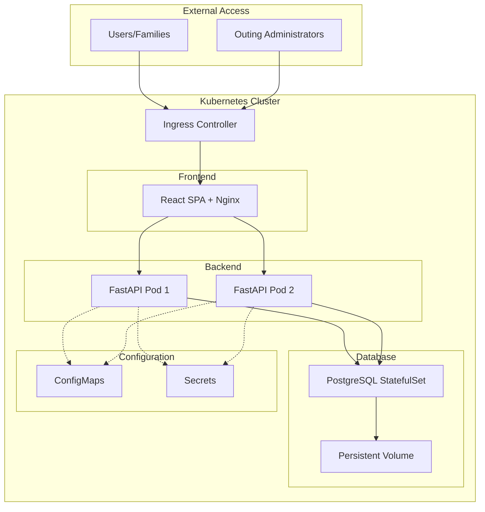
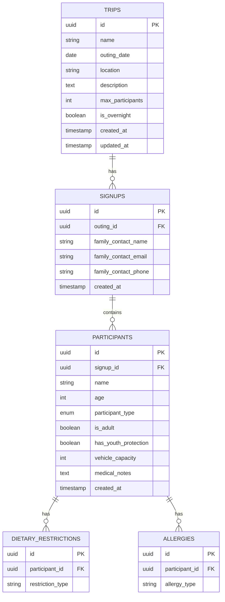

# Trailhead - System Architecture

## Overview
A full-stack web application for managing scout troop outings with PostgreSQL backend, Python FastAPI REST API, React frontend, and Kubernetes deployment.

## System Architecture



## Database Schema



### Database Tables Detail

#### outings
- `id` (UUID, PK): Unique outing identifier
- `name` (VARCHAR): Outing name
- `outing_date` (DATE): Date of the outing
- `location` (VARCHAR): Outing location
- `description` (TEXT): Detailed outing description
- `max_participants` (INTEGER): Maximum number of participants
- `is_overnight` (BOOLEAN): Whether outing requires overnight stay
- `created_at` (TIMESTAMP): Record creation time
- `updated_at` (TIMESTAMP): Last update time

#### signups
- `id` (UUID, PK): Unique signup identifier
- `outing_id` (UUID, FK): Reference to outings table
- `family_contact_name` (VARCHAR): Primary family contact
- `family_contact_email` (VARCHAR): Contact email
- `family_contact_phone` (VARCHAR): Contact phone
- `created_at` (TIMESTAMP): Signup time

#### participants
- `id` (UUID, PK): Unique participant identifier
- `signup_id` (UUID, FK): Reference to signups table
- `name` (VARCHAR): Participant name
- `age` (INTEGER): Participant age
- `participant_type` (ENUM): 'scout' or 'adult'
- `is_adult` (BOOLEAN): Whether participant is adult
- `has_youth_protection` (BOOLEAN): Scouting America youth protection training status (adults only)
- `vehicle_capacity` (INTEGER): Number of people can transport (adults only)
- `medical_notes` (TEXT): Additional medical information
- `created_at` (TIMESTAMP): Record creation time

#### dietary_restrictions
- `id` (UUID, PK): Unique identifier
- `participant_id` (UUID, FK): Reference to participants table
- `restriction_type` (VARCHAR): Type of dietary restriction (vegetarian, vegan, gluten-free, dairy-free, etc.)

#### allergies
- `id` (UUID, PK): Unique identifier
- `participant_id` (UUID, FK): Reference to participants table
- `allergy_type` (VARCHAR): Type of allergy (peanuts, tree nuts, shellfish, eggs, soy, wheat, etc.)

## API Endpoints

### Outing Management (Admin)

#### GET /api/outings
- Description: List all outings
- Response: Array of outing objects with signup counts

#### POST /api/outings
- Description: Create a new outing
- Request Body:
```json
{
  "name": "Summer Camp 2026",
  "outing_date": "2026-07-15",
  "location": "Camp Wilderness",
  "description": "Week-long summer camp",
  "max_participants": 50,
  "is_overnight": true
}
```

#### GET /api/outings/{outing_id}
- Description: Get outing details with all signups
- Response: Outing object with nested signups and participants

#### PUT /api/outings/{outing_id}
- Description: Update outing details
- Request Body: Same as POST /api/outings

#### DELETE /api/outings/{outing_id}
- Description: Delete a outing (only if no signups)

#### GET /api/outings/{outing_id}/signups
- Description: Get all signups for a specific outing
- Response: Array of signup objects with participant details

#### GET /api/outings/{outing_id}/export
- Description: Export outing signups as CSV
- Response: CSV file download

### Participant Signups

#### GET /api/outings/available
- Description: List available outings for signup
- Response: Array of outings with available spots

#### POST /api/signups
- Description: Submit a family signup for a outing
- Request Body:
```json
{
  "outing_id": "uuid",
  "family_contact": {
    "name": "John Doe",
    "email": "john@example.com",
    "phone": "555-1234"
  },
  "participants": [
    {
      "name": "Scout Name",
      "age": 12,
      "participant_type": "scout",
      "dietary_restrictions": ["vegetarian", "dairy-free"],
      "allergies": ["peanuts"],
      "medical_notes": "Carries EpiPen"
    },
    {
      "name": "Parent Name",
      "age": 42,
      "participant_type": "adult",
      "has_youth_protection": true,
      "vehicle_capacity": 5,
      "dietary_restrictions": [],
      "allergies": [],
      "medical_notes": ""
    }
  ]
}
```

#### GET /api/signups/{signup_id}
- Description: Get signup details
- Response: Signup object with all participants

#### DELETE /api/signups/{signup_id}
- Description: Cancel a signup

### Health & Status

#### GET /api/health
- Description: Health check endpoint
- Response: `{"status": "healthy"}`

#### GET /api/ready
- Description: Readiness check (includes DB connection)
- Response: `{"status": "ready"}`

## Frontend Architecture

### Component Structure

```
src/
├── components/
│   ├── Admin/
│   │   ├── OutingAdmin.tsx          # Outing creation and management
│   │   ├── OutingList.tsx           # List of all outings
│   │   ├── SignupViewer.tsx       # View signups for a outing
│   │   └── ExportButton.tsx       # Export signups to CSV
│   ├── Participant/
│   │   ├── OutingBrowser.tsx        # Browse available outings
│   │   ├── SignupForm.tsx         # Multi-participant signup form
│   │   ├── ParticipantForm.tsx    # Individual participant form
│   │   ├── DietaryCheckboxes.tsx  # Dietary restrictions selection
│   │   ├── AllergyCheckboxes.tsx  # Allergy selection
│   │   └── AdultQuestions.tsx     # Scouting America training and vehicle capacity
│   └── Shared/
│       ├── OutingCard.tsx           # Outing display card
│       ├── LoadingSpinner.tsx     # Loading indicator
│       └── ErrorMessage.tsx       # Error display
├── pages/
│   ├── AdminPage.tsx              # Admin dashboard
│   ├── ParticipantPage.tsx        # Participant signup page
│   └── HomePage.tsx               # Landing page
├── services/
│   ├── api.ts                     # API client
│   └── types.ts                   # TypeScript interfaces
├── hooks/
│   ├── useOutings.ts                # Outing data management
│   └── useSignup.ts               # Signup form management
└── utils/
    ├── validation.ts              # Form validation
    └── formatting.ts              # Data formatting
```

### Key Features

1. **Admin Interface**
   - Create and manage outings
   - View all signups with filtering
   - Export signup data to CSV
   - Real-time capacity tracking

2. **Participant Interface**
   - Browse available outings
   - Multi-person signup (scouts + adults)
   - Dietary restrictions and allergies
   - Adult-specific questions (Scouting America training, vehicle capacity)
   - Form validation and error handling

## Kubernetes Deployment

### Resources

1. **Frontend Deployment**
   - 2 replicas for high availability
   - Nginx serving React build
   - Resource limits: 256Mi memory, 200m CPU

2. **Backend Deployment**
   - 2 replicas for load balancing
   - FastAPI with Gunicorn/Uvicorn
   - Resource limits: 512Mi memory, 500m CPU

3. **PostgreSQL StatefulSet**
   - Single replica with persistent storage
   - 10Gi persistent volume
   - Resource limits: 1Gi memory, 1000m CPU

4. **Services**
   - frontend-service (ClusterIP)
   - backend-service (ClusterIP)
   - postgres-service (ClusterIP)

5. **Ingress**
   - Routes `/` to frontend
   - Routes `/api/*` to backend
   - TLS termination (optional)

6. **ConfigMaps**
   - Database connection settings
   - API URLs
   - Feature flags

7. **Secrets**
   - Database credentials
   - API keys (if needed)

### Deployment Strategy

1. **Development**: docker-compose for local testing
2. **Staging**: Minikube or kind for validation
3. **Production**: Cloud provider (AWS EKS, GKE, AKS) or on-premises

## Technology Stack

### Frontend
- React 17+ with TypeScript
- React Router for navigation
- Axios for API calls
- CSS Modules or Styled Components
- Form validation library (React Hook Form)

### Backend
- Python 3.11+
- FastAPI framework
- SQLAlchemy ORM
- Alembic for migrations
- Pydantic for validation
- asyncpg for async PostgreSQL

### Database
- PostgreSQL 15+
- UUID primary keys
- Proper indexing on foreign keys
- Timestamp tracking

### DevOps
- Docker for containerization
- Kubernetes for orchestration
- Nginx for frontend serving
- Gunicorn/Uvicorn for Python ASGI

## Security Considerations

1. **Input Validation**: All inputs validated on both frontend and backend
2. **SQL Injection Prevention**: Using ORM with parameterized queries
3. **CORS Configuration**: Proper CORS headers for API
4. **Rate Limiting**: API rate limiting to prevent abuse
5. **Data Privacy**: Secure handling of personal information
6. **Secrets Management**: Kubernetes secrets for sensitive data

## Scalability

1. **Horizontal Scaling**: Multiple backend replicas behind load balancer
2. **Database Connection Pooling**: Efficient database connections
3. **Caching**: Optional Redis for frequently accessed data
4. **CDN**: Static assets served via CDN (optional)

## Monitoring & Logging

1. **Health Checks**: Liveness and readiness probes
2. **Application Logs**: Structured logging to stdout
3. **Metrics**: Prometheus-compatible metrics (optional)
4. **Alerts**: Critical error notifications (optional)

## Future Enhancements

1. Email notifications for signup confirmations
2. Calendar integration (iCal export)
3. Payment processing for outing fees
4. Photo gallery for past outings
5. Mobile app (React Native)
6. Advanced reporting and analytics
7. Integration with Scouting America systems